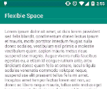
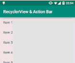
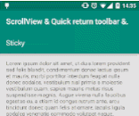
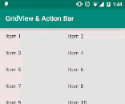

Android-ObservableScrollView
===

[](https://travis-ci.org/ksoichiro/Android-ObservableScrollView)
[](https://github.com/ksoichiro/Android-ObservableScrollView/releases/latest)
[](https://android-arsenal.com/details/1/1136)

Android library to observe scroll events on scrollable views.  
It's easy to interact with the Toolbar introduced in Android 5.0 Lollipop  and may be helpful to implement look and feel of Material Design apps.












## Installation

```groovy
dependencies {
    compile 'com.github.ksoichiro:android-observablescrollview:1.2.1'
}
```

## Samples

See `observablescrollview-samples` directory.

To install:

```sh
$ ./gradlew installDebug
```

## Supported widgets

| Widget | Since | Note |
|:------:|:-----:| ---- |
| ListView | v1.0.0 |    |
| ScrollView | v1.0.0 |  |
| WebView | v1.0.0 |     |
| RecyclerView | v1.1.0 | It's supported but RecyclerView provides scroll states and position with [OnScrollListener](https://developer.android.com/reference/android/support/v7/widget/RecyclerView.OnScrollListener.html). You should use it if you don't have any reason. |
| GridView | v1.2.0 | |

## How to use

### Add widgets to your layout

Use one of the `ObservableListView`, `ObservableScrollView`, `ObservableWebView`, `ObservableRecyclerView` in your XML layout file.

### Control scroll events with callbacks

Widgets above provides callbacks with `ObservableScrollViewCallbacks` interface.  
You can listen scroll events of the widgets by using `setScrollViewCallbacks()`.

```java
    ObservableListView listView = (ObservableListView) findViewById(R.id.list);
    listView.setScrollViewCallbacks(this);
```

Then implement your interaction codes to the callbacks.  
Example:

```java
    @Override
    public void onUpOrCancelMotionEvent(ScrollState scrollState) {
        ActionBar ab = getSupportActionBar();
        if (scrollState == ScrollState.UP) {
            if (ab.isShowing()) {
                ab.hide();
            }
        } else if (scrollState == ScrollState.DOWN) {
            if (!ab.isShowing()) {
                ab.show();
            }
        }
    }
```

See sample project's `Activity` codes for more details.

## Developed By

* Soichiro Kashima - <soichiro.kashima@gmail.com>


## Credits

* Inspired by `ObservableScrollView` in [romannurik-code](https://code.google.com/p/romannurik-code/).


## License

    Copyright 2014 Soichiro Kashima

    Licensed under the Apache License, Version 2.0 (the "License");
    you may not use this file except in compliance with the License.
    You may obtain a copy of the License at

        http://www.apache.org/licenses/LICENSE-2.0

    Unless required by applicable law or agreed to in writing, software
    distributed under the License is distributed on an "AS IS" BASIS,
    WITHOUT WARRANTIES OR CONDITIONS OF ANY KIND, either express or implied.
    See the License for the specific language governing permissions and
    limitations under the License.

