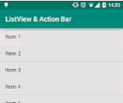
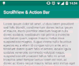
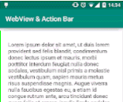
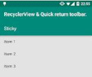
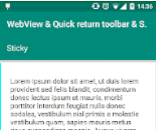

Android-ObservableScrollView
===

[](https://travis-ci.org/ksoichiro/Android-ObservableScrollView)
[](https://coveralls.io/r/ksoichiro/Android-ObservableScrollView?branch=master)
[](https://github.com/ksoichiro/Android-ObservableScrollView/releases/latest)
[](https://android-arsenal.com/api?level=9)
[](https://android-arsenal.com/details/1/1136)

Android library to observe scroll events on scrollable views.  
It's easy to interact with the Toolbar introduced in Android 5.0 Lollipop  and may be helpful to implement look and feel of Material Design apps.













## Samples

### Google Play store

[](https://play.google.com/store/apps/details?id=com.github.ksoichiro.android.observablescrollview.samples2)

### wercker

If you are a wercker user, you can download the latest build artifact.
[See here for details](https://github.com/ksoichiro/Android-ObservableScrollView/tree/master/docs/wercker.md).

[](https://app.wercker.com/project/bykey/8d1e27d9f4a662b25dbe70402733582b)

### Install manually with Gradle

Clone this repository and build the app using Gradle wrapper.

Mac / Linux / Git Bash, Cygwin on Windows:

```sh
$ git clone https://github.com/ksoichiro/Android-ObservableScrollView.git 
$ cd Android-ObservableScrollView
$ ./gradlew installDevDebug
```

Windows:

```sh
> git clone https://github.com/ksoichiro/Android-ObservableScrollView.git 
> cd Android-ObservableScrollView
> gradlew installDevDebug
```

## Usage

### Add to your dependencies

AAR is distributed on the Maven Central repository.

```groovy
repositories {
    mavenCentral()
}

dependencies {
    compile 'com.github.ksoichiro:android-observablescrollview:1.5.0'
}
```

Basically this project supports Android Studio.  
If you'd like to use Eclipse, please [see here](https://github.com/ksoichiro/Android-ObservableScrollView/tree/master/docs/eclipse.md).
It's partially supported.

### Add widgets to your layout

Use one of the `ObservableListView`, `ObservableScrollView`, `ObservableWebView`, `ObservableRecyclerView`, `ObservableGridView` in your XML layout file.

### Control scroll events with callbacks

Widgets above provides callbacks with `ObservableScrollViewCallbacks` interface.  
You can listen scroll events of the widgets by using `setScrollViewCallbacks()`.

```java
    ObservableListView listView = (ObservableListView) findViewById(R.id.list);
    listView.setScrollViewCallbacks(this);
```

Then implement your interaction codes to the callbacks.  
Example:

```java
    @Override
    public void onUpOrCancelMotionEvent(ScrollState scrollState) {
        ActionBar ab = getSupportActionBar();
        if (scrollState == ScrollState.UP) {
            if (ab.isShowing()) {
                ab.hide();
            }
        } else if (scrollState == ScrollState.DOWN) {
            if (!ab.isShowing()) {
                ab.show();
            }
        }
    }
```

See [sample app's Activity codes](https://github.com/ksoichiro/Android-ObservableScrollView/tree/master/observablescrollview-samples/src/main/java/com/github/ksoichiro/android/observablescrollview/samples) for more details.


## Supported widgets

Widgets are named with `Observable` prefix.  
(e.g. `ListView` → `ObservableListView`)  
You can handle these widgets with `Scrollable` interface.

| Widget | Since | Note |
|:------:|:-----:| ---- |
| ListView | v1.0.0 |    |
| ScrollView | v1.0.0 |  |
| WebView | v1.0.0 |     |
| RecyclerView | v1.1.0 | It's supported but RecyclerView provides scroll states and position with [OnScrollListener](https://developer.android.com/reference/android/support/v7/widget/RecyclerView.OnScrollListener.html). You should use it if you don't have any reason. |
| GridView | v1.2.0 | |


## Environment

This project is built and tested under the following environment.

| OS             | IDE                | JDK |
| -------------- | ------------------ | --- |
| Mac OS X 10.10 | Android Studio 1.0 | 1.7 |

## Release notes

* v1.5.0
    * Add a helper class `CacheFragmentStatePagerAdapter` to implement ViewPager pattern.
    * Fix that swipe down (over-scroll) causes item click.
* v1.4.0
    * Add a custom view named `TouchInterceptionFrameLayout` and a new API `setTouchInterceptionViewGroup()` for `Scrollable`.  
      With these class and API, you can move `Scrollable` itself using its scrolling events.
    * Add a helper class `ScrollUtils` for implementing scrolling effects.
* v1.3.2
    * Fix that `ObservableRecyclerView` causes `BadParcelableException` on `onRestoreInstanceState`.
* v1.3.1
    * Fix that `onDownMotionEvent` not called and parameters of `onScrollChanged` are incorrect
      when children views handle touch events.
* v1.3.0
    * Add new interface `Scrollable` to provide common API for scrollable widgets. 
* v1.2.1
    * Fix that the scroll states and other internal information are lost after `onSaveInstanceState()`.
    * Fix that the scrollY is incorrect if the ListView/RecyclerView don't scroll from the top.
      (It's just approximating the scroll offset and not the complete solution but better than before.)
* v1.2.0
    * Add GridView support.
    * Fix ObservableListView cannot detect onScrollChanged on Android 2.3.
    * Fix ObservableScrollView cannot detect UP and DOWN state in onUpOrCancelMotionEvent before Android 4.4.
* v1.1.0
    * Add RecyclerView support.
* v1.0.0
    * Initial release.


## Apps that uses this library

* [Jair Player](https://play.google.com/store/apps/details?id=aj.jair.music) by Akshay Chordiya
* [My Gradle](https://play.google.com/store/apps/details?id=se.project.generic.mygradle) by Erick Chavez Alcarraz

If you're using this library in your app and you'd like to list it here,  
please let me know via [email](soichiro.kashima@gmail.com) or pull requests or issues.


## Contributions

Any contributions are welcome!  
Please check the [contributing guideline](https://github.com/ksoichiro/Android-ObservableScrollView/tree/master/CONTRIBUTING.md) before submitting a new issue.


## Developed By

* Soichiro Kashima - <soichiro.kashima@gmail.com>


## Credits

* Inspired by `ObservableScrollView` in [romannurik-code](https://code.google.com/p/romannurik-code/).


## License

    Copyright 2014 Soichiro Kashima

    Licensed under the Apache License, Version 2.0 (the "License");
    you may not use this file except in compliance with the License.
    You may obtain a copy of the License at

        http://www.apache.org/licenses/LICENSE-2.0

    Unless required by applicable law or agreed to in writing, software
    distributed under the License is distributed on an "AS IS" BASIS,
    WITHOUT WARRANTIES OR CONDITIONS OF ANY KIND, either express or implied.
    See the License for the specific language governing permissions and
    limitations under the License.

